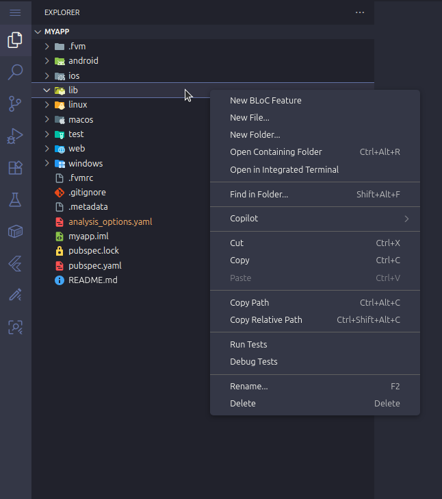

# Flutter BLoC Feature Generator

Capek bikin folder BLoC satu-satu? Nah, ekstensi ini bakal jadi teman baikmu buat ngebangun fitur baru di proyek Flutter!

## Apa Aja Sih Kerennya?

* **Super Cepat**: Cuma butuh beberapa klik aja buat bikin semua struktur folder fitur (`bloc`, `data`, `presentation`). Gak pake lama!
* **Udah Ada Isinya**: Bukan cuma folder kosong, lho! Setiap file udah diisi sama kode *boilerplate* yang siap pakai dan pastinya ngikutin standar BLoC.
* **Gampang Banget**: Tinggal klik kanan di folder Explorer, langsung deh bisa bikin fitur baru. Praktis!

## Gimana Caranya? Gini Doang Kok:

1.  Pertama, buka dulu proyek Flutter kamu di VS Code.
2.  Di Explorer, cari folder buat naro fitur barumu (biasanya sih di `lib/features`), terus klik kanan di situ.
3.  Nanti bakal muncul pilihan **"New BLoC Feature"**. Langsung klik aja!
4.  Kasih nama buat fiturmu pake format `snake_case` ya (contoh: `detail_produk`).
5.  Tekan Enter... dan sulaaap! Semua folder dan file buat fitur barumu udah jadi.

